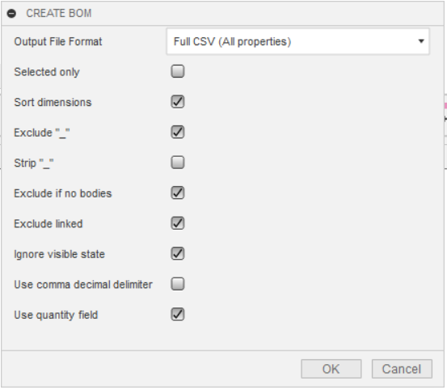
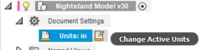
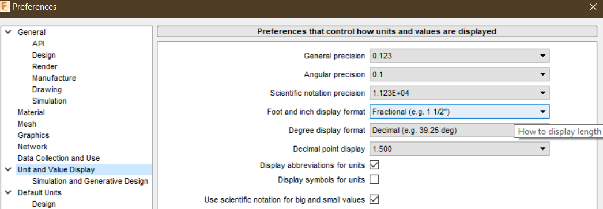

# CSV-BOM
Creates a bill of material and cut lists from the browser components tree in Autodesk Fusion360. CSV BOM Plus is a rewrite of the original [CSV-BOM](https://github.com/macmanpb/CSV-BOM) with the following enhancements:
* Code improvements: 
  * CSV BOM Plus refactored to separate the CSV generating logic from the Fusion 360 component tree walking logic, resulting in decoupled code that was easier to test. 
  * Added unit tests.
  * Switched to Python built-in CSV writers instead of string contatenation. 
* CSV BOM Plus supports templated CSV generation, streamling the input options, and making it simple to add new output file formats. 
* Support for all unit formats (including fractional inch).
* Adds support for [MaxCut](https://www.maxcutsoftware.com/) for cutlist generation (in addition to [Gary Darby's Cutlist](http://www.delphiforfun.org/Programs/CutList.htm)).

## General Usage Instructions
After [installation](#installation), go to the toolbar "Create" submenu and choose "Create BOM". A dialog appears which shows provided options to control the CSV output. Click OK and a save file dialog comes up. Name your file and click OK. After creating the file a message box popups with the information that the file has successfully created. Open a suitable app which can handle CSV formatted files. Import the CSV file and voila the BOM of your design is showing.  

### Supported options



* **Output File Format**
> Pick the appropriate [output format](#outputs). 

* **Selected only**
> Means that only selected components will be exported to CSV.

* **Sort Dimensions**
> If you are cutting your parts out of any kind of panelized material (i.e. plywood), you want the height of the part usually be the thickness of your material. 
If you select this option, the dimensions are sorted to accommodate this, no matter how your part is oriented in your model. 
The smallest value becomes the height (thickness), the next larger the width and the largest the length.

* **Exclude "_"**
> Often users sign components with an underscore to make them visually for internal use. This option ignores such signed components.
> If you deselect this option another option comes up which is descripted next.

* **Strip "_"**
> You want underscore signed components too? No problem, but you dont want the underscore in the outputted component name? Then this option is right for you. It strippes the underscore away.

* **Exclude if no bodies**
> Components without a body makes no sense. Activate this option to ignore them.

* **Exclude linked**
> If linked components have there own BOM, you can exclude them to keep your BOM lean and clean.

* **Ignore visible state**
> The component is not visible but it should taken to the BOM? Ok, activate this option to do that.

* **Use comma decimal delimiter**
> If checked CSV-BOM will replace the dot decimal delimiter with a comma. This is useful for all countries that uses a comma for float decimal delimiters.
> As a benefit of that option, Applications like Apple Numbers, MS-Excel or OpenOffice can handle these CSV-entries as native numbers instead of simple text.

* **Use Quantity Field**
> For multiple instances of the same compenent, insert a single row and quantity field. If not, repeat the row. There are instances (e.g. mail merge in Word to print labels) where repeated rows are easier to work with. 


<a id="outputs"></a>

## Output Formats

* Full CSV (All Properties).
> Part name,Quantity,Volume cm^3,Width (units),Length (units),Height (units),Area cm^2,Mass kg,Density kg/cm^2,Material,Description

* Minimal CSV (Dimensions and Name Only)
> Part name,Quantity,Width (unit),Length (unit),Height (unit)

* Cutlist (MaxCut) 
> CSV suitable for import into [MaxCut](https://www.maxcutsoftware.com/)

* Cutlist (Gary Darby)
> Text file suitable for [Gary Darby's Cutlist](http://www.delphiforfun.org/Programs/CutList.htm)

## Units

In all cases, length units are determined from your model options and user preferences. All other units use metric SI (currently Fusion 360 doesn't support converting volume, mass, and density, only length). 






## Adding Additional Output Formats

If others might benefit from your output format, please submit a pull request. 

1. In file CSV_BOM_Core.py, locate the class `OutputFormats`
2. Add a new variable with a two-line CSV string, such as:

```
FullCsvTemplate = """Part name,Quantity,Volume cm^3,Width {},Length {},Height {},Area cm^2,Mass kg,Density kg/cm^2,Material,Description
Name,Quantity,Volume,Width,Length,Height,Area,Mass,Density,Material,Description"""
```

3. The first row is your CSV's header; {} will be substituted with the length unit (e.g. inch, mm) per the model settings and your user preferences. The second row will contain the values specified. 
4. `FullCsvTemplate` shows all available values. Strings must match exactly (case, whitespace, etc). 

## Cutlists

Cutlist software is for woodworkers who want to optimize the cuts they make. Below is a screenshot from Gary Darby's showing what it might look like. 

>   
> Example Cut List/Panel Optimization
	
> Note: If the cut list software is not able to read your dimensions properly, try changing the option "Use comma delimiter" in CSV-BOM (see below).


<a id="installation"></a>

## Installation

1. Checkout the repository from Github or [download the ZIP-package](https://github.com/pettijohn/CSV-BOM-Plus/archive/master.zip)
2. If you downloaded a ZIP, extract the contents to a preferred location
3. Open Fusion360 and load the Add-Ins dialog

	

4. To add the CSV-BOM Add-In, click on the Add-Ins tab and then on the small plus icon.

	

5. Locate the unzipped _CSV-BOM-master_ folder, open it and choose _CSV-BOM.py_ and click **OK**

6. The Add-In is now listed but not running. Select the _CSV-BOM_ entry, activate _Run on Startup_ and click _Run_

	

After _Run_ was clicked the Add-Ins dialog closes automatically.
Check the _Create_ toolbar panel! CSV-BOM is ready to use ;-)


